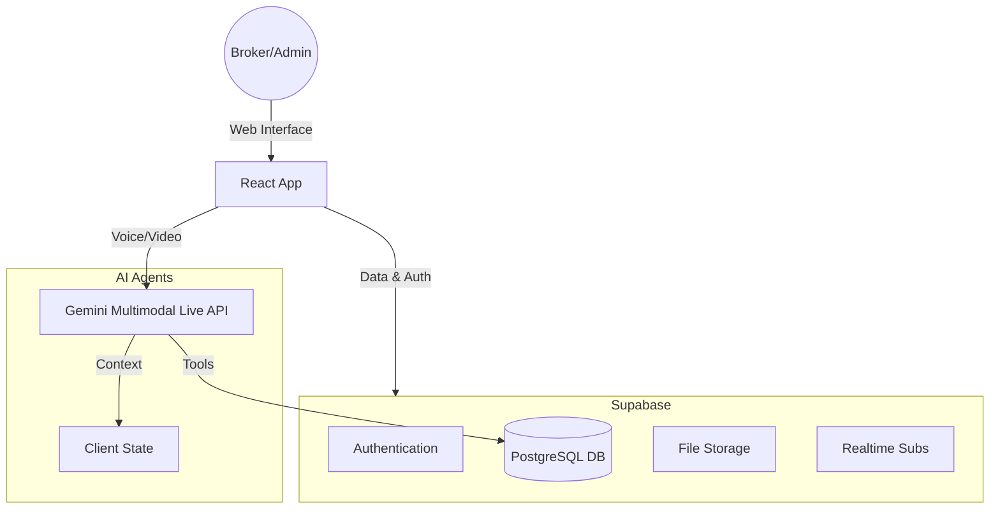

# Eburon Administration System - Developer & Admin Guide

## 1. Project Overview & Goal
**Goal:** Build the world's most advanced, AI-native Real Estate Administration Platform ("Eburon"). 
The system serves as a central nervous system for Brokers, Property Managers, and Owners. It replaces fragmented tools (CRM, Dialer, Excel, Email) with a single, voice-first interface driven by specific AI Agents.

**Core Philosophy:** "The AI does the work; the human makes the decision."

## 2. Architecture Overview
The application is built as a **Voice-First SPA (Single Page Application)** using:
- **Frontend:** React + Vite + Tailwind CSS (High performance, low latency).
- **Backend/Data:** Supabase (PostgreSQL, Auth, Realtime, Storage).
- **AI Core:** Google Gemini (Multimodal Live API) for real-time conversation and reasoning.
- **Telephony:** WebRTC / SIP integration (handled via client-side audio processing).

### System Context (Mermaid)

## 3. Database Schema (Production Blueprint)

### Core Entities
The schema is designed to track the lifecycle of a **Lead** becoming a **Tenant/Owner** and the management of **Properties**.

| Table | Description | Key Fields |
| :--- | :--- | :--- |
| **`users` (profiles)** | All system users (Brokers, Owners, etc.) | `id`, `email`, `role` (ENUM), `full_name`, `avatar_url` |
| **`properties`** | Real estate assets managed | `id`, `address`, `owner_id` (FK), `status`, `financial_data` (JSONB) |
| **`listings`** | Public-facing marketing data for properties | `id`, `property_id` (FK), `price`, `images` (Array), `seo_tags` |
| **`interactions`** | Log of all calls, emails, and meetings | `id`, `lead_id`, `type` (Call/Email), `recording_url`, `transcription` |
| **`leads`** | Potential clients/opportunities | `id`, `status` (New, Qualified, Won), `source`, `ai_summary` |
| **`tasks`** | Action items for humans or AI | `id`, `assigned_to`, `due_date`, `status`, `auto_generated_by` |
| **`tickets`** | Maintenance/Support requests | `id`, `property_id`, `priority`, `status`, `contractor_id` |

## 4. Production-Ready Roadmap (TODO)

### 🏗 Data Layer & Security
- [ ] **Role-Based Access Control (RLS):**
    - Implement granular RLS policies in Supabase.
    - *Rule:* Brokers see all; Owners only see their properties; Tenants only see their ticket status.
- [ ] **Data Validation Triggers:**
    - Add PostgreSQL triggers to validate phone numbers and emails on insert.
    - Auto-update `updated_at` timestamps.
- [ ] **Storage Buckets:**
    - Create `recordings` bucket (private, accessible to Admins).
    - Create `documents` bucket (contracts, invoices).
- [ ] **Audit Logging:**
    - Create `audit_logs` table to track WHO changed WHAT (crucial for real estate compliance).

### 🧩 Core Functions (Backend Logic)
- [ ] **AI-Driven Lead Processing (Edge Function):**
    - *Trigger:* New entry in `leads` table.
    - *Action:* Call Gemini to score the lead based on initial data -> Update `score` field.
- [ ] **Automated Task Generation:**
    - *Logic:* If `interactions.outcome` == 'follow_up', auto-create a `task` for the next business day.
- [ ] **Notification System:**
    - Implement Realtime subscriptions for 'New Lead' and 'High Priority Ticket' events.
    - Push notifications integration.

### 🚀 Client Features (Frontend)
- [ ] **Offline Mode:**
    - Implement `TanStack Query` with persistence for offline data access (viewing properties/leads in basements/no-signal areas).
- [ ] **Unified Inbox:**
    - Combine Email, WhatsApp, and SMS into a single `Conversation` view linked to the Lead.
- [ ] **Financial Dashboard:**
    - Charts for Owners: "Rent Collected vs Expenses".
    - Admin View: "Commission Pipeline".

### 🔒 Operational Excellence
- [ ] **Environment Security:**
    - Ensure all API keys are strictly strictly scoped (e.g., Supabase interactions limited by RLS, not just key capability).
- [ ] **CI/CD Pipeline:**
    - Auto-deploy to Staging on push to `development`.
    - Automated E2E tests using Playwright for critical flows (Login -> Call -> Save).
